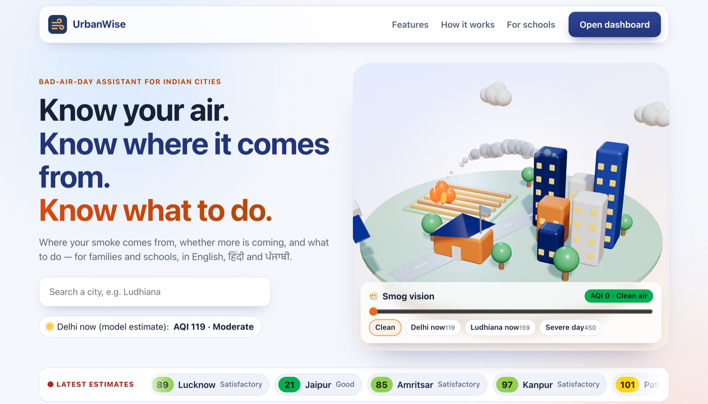
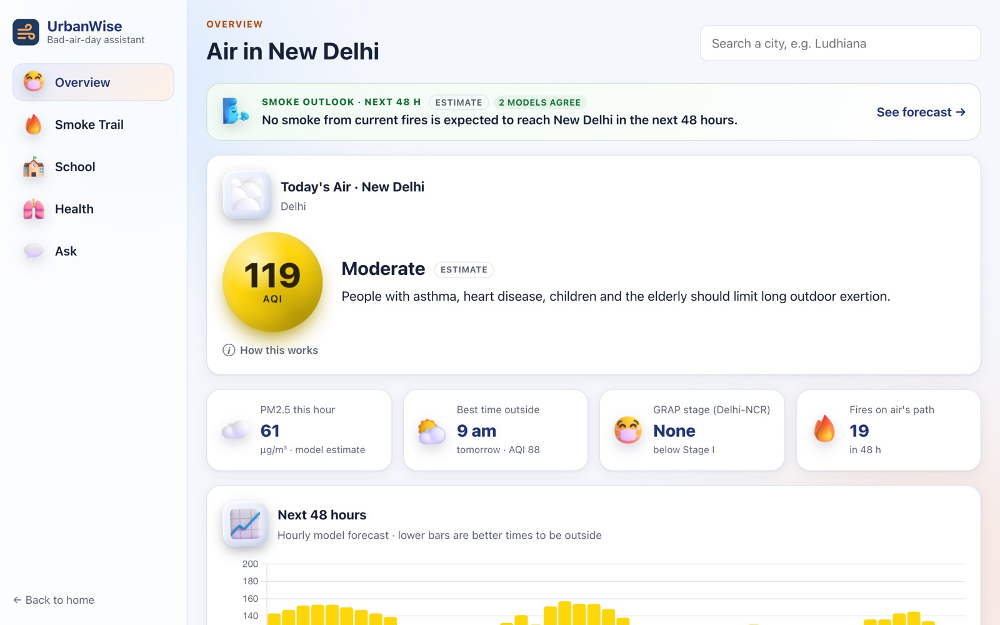
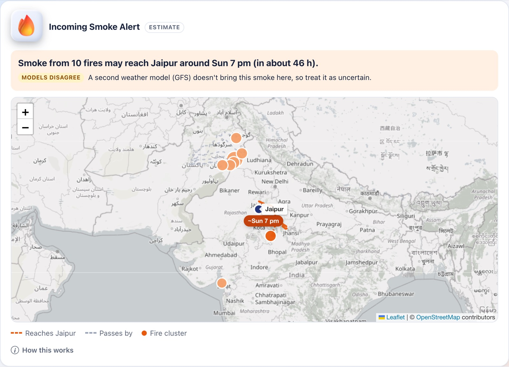
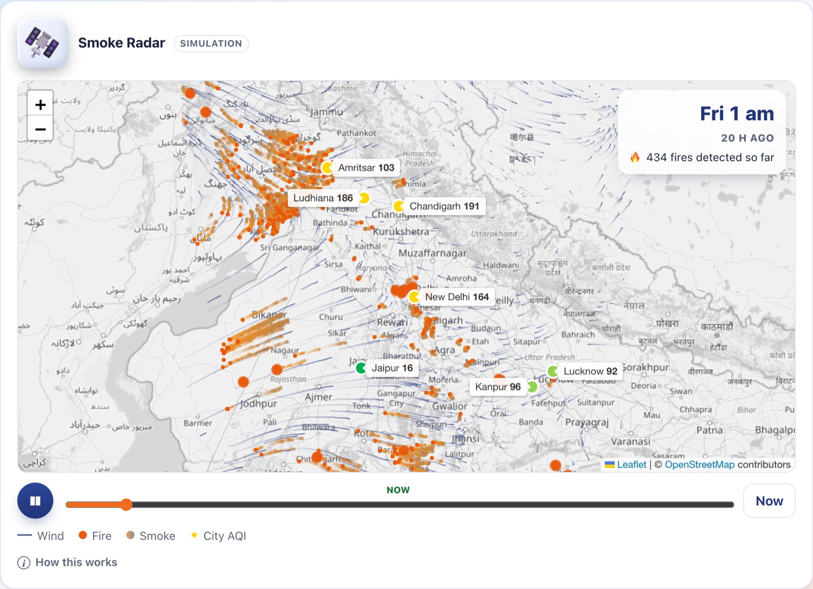
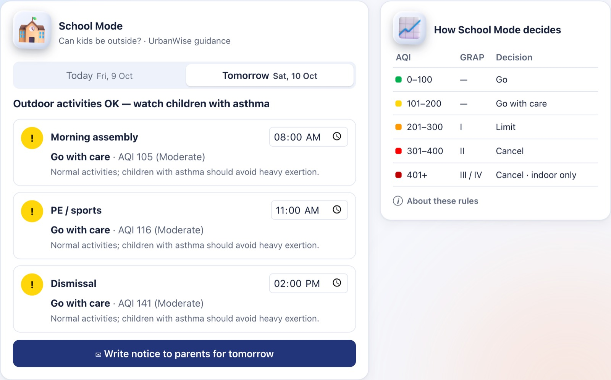
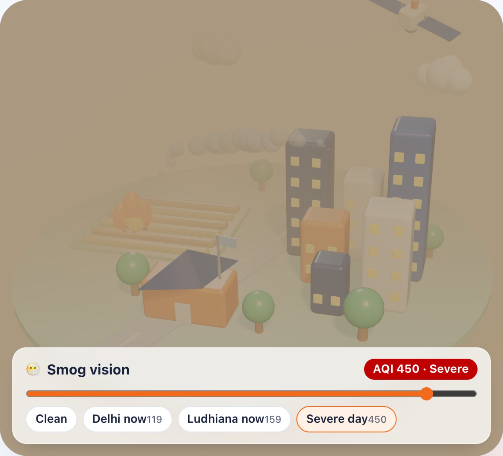
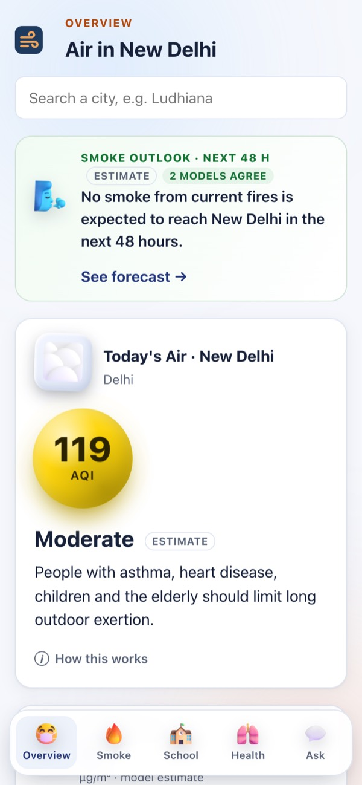
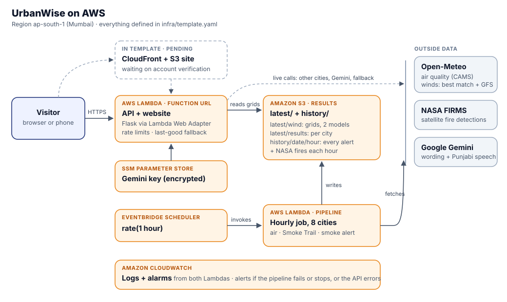

# UrbanWise

> **A bad-air-day assistant for Indian cities**, built for **Environmental Hacks Track 1 (Air)**.
> Most AQI apps only tell you *what* the air is like. **UrbanWise** also shows *where the smoke is coming from*, *whether more is on the way*, and *what to do about it*.

**Try it live:** https://23ggiipmh7h5sh6y4cprovs2pq0mslwe.lambda-url.ap-south-1.on.aws/ (running on AWS Lambda in Mumbai)



---

## 🚨 The Problem

Every winter, Delhi-NCR and other North Indian cities spend weeks with **"Very Poor"** or **"Severe"** air:
- **Schools** guess whether to hold assembly or PE outdoors.
- **Parents** see an AQI number without knowing what it means for their child.
- **People at higher risk** can't plan around the worst hours.
- **Residents** can't see how crop-residue fires upwind affect the air they breathe.

---

## 👥 Who It's For

- 🏫 **School administrators**
- 👨‍👩‍👧 **Parents**
- 🫁 **High-risk people** (asthma, heart conditions, the elderly)
- 🌆 **Residents** who want to know where their smoke comes from

---

## ✨ Features

### ⭐ Headline Features

* 🔥 **Smoke Trail**: traces your city's air back 48 hours on the wind and matches the path against NASA satellite fire detections, e.g. *"The air over New Delhi likely passed 8 satellite-detected fires near Palwal and Faridabad."*
* 🚨 **Incoming Smoke Alert**: runs today's fire clusters *forward* on forecast winds to estimate when smoke may reach your city, e.g. *"Smoke from 45 satellite-detected fires near Phalodi may reach New Delhi around Sat 1 am."* Every alert is re-run on a second weather model (GFS) and says whether the two agree.
* 🛰️ **Smoke Radar**: a 48-hour time-lapse of wind, fires and drifting smoke over North India.
* 📝 **Parent notices**: School Mode drafts a notice to parents in **English, Hindi and Punjabi**. The principal reviews it and shares it on WhatsApp.
* 🔬 **Checked, not just claimed**: we compared our trajectories with NOAA HYSPLIT and wrote up where they hold and where they don't ([docs/VALIDATION.md](docs/VALIDATION.md)).

### ⚙️ Core Features

* 🌡️ **Today's Air**: AQI on India's CPCB scale with plain-language advice.
* 📈 **48-Hour Forecast**: the best and worst hours to be outside.
* 🏫 **School Mode**: go / limit / cancel guidance for assembly, PE and dismissal, checked against each hour's forecast.
* 🫁 **Exposure Calculator**: how much pollution you'd breathe in, shown as a cigarette equivalent.
* 🪟 **Ventilation Window**: the cleanest hours today to open windows.
* 🎙️ **Ask UrbanWise**: questions by voice or text in English, हिंदी or ਪੰਜਾਬੀ, answered from the city's data (with read-aloud).
* 😶‍🌫️ **Smog Vision**: an AQI slider that fills a 3D city with matching haze.

---

## 📸 Screenshots

Taken on 9 Oct 2026 from the live AWS deployment.

| Dashboard | Incoming Smoke Alert |
| :---: | :---: |
|  |  |
| **Smoke Radar** | **School Mode** |
|  |  |
| **Smog Vision** | **On a phone** |
|  |  |

---

## 🔬 Where the numbers come from

We try to be clear about what is measured and what is estimated:

| What | Source | Type |
| :--- | :--- | :--- |
| PM2.5 / PM10 | CAMS global model via [Open-Meteo](https://open-meteo.com/) | **Model estimate**, not a station reading |
| AQI | Calculated by UrbanWise from the above using CPCB breakpoints (24-hour average) | Calculated |
| Fires | [NASA FIRMS](https://firms.modaps.eosdis.nasa.gov/) VIIRS (S-NPP) detections | Satellite-detected thermal anomalies |
| Winds (~750 m) | Open-Meteo forecast | Model |
| Smoke Trail / Incoming Smoke | UrbanWise back- and forward-trajectories on those winds | Simplified model estimate ("likely" / "may") |
| School Mode | UrbanWise guidance based on CPCB AQI categories | Not an official CPCB or school-board rule |
| GRAP stage | CAQM Graded Response Action Plan | Shown only for Delhi-NCR (approx. within 130 km of Delhi) |
| Notices / assistant wording | Google Gemini | Wording only; all numbers come from the data above |

UrbanWise gives estimates for planning, not medical advice. The full method, assumptions and limits are in [docs/METHODS.md](docs/METHODS.md), and the trajectory check against NOAA HYSPLIT is in [docs/VALIDATION.md](docs/VALIDATION.md).

---

## 🛠️ Tech

- **Frontend**: Vue 3, Vite, Leaflet, Chart.js, Three.js
- **Backend**: Flask (Python), with Gemini for notices, the assistant and Punjabi speech
- **Data**: Open-Meteo (air quality, winds, geocoding), NASA FIRMS
- **AWS**: everything is in [infra/template.yaml](infra/template.yaml) and deployed with `infra/deploy.sh`



- **Lambda** runs the Flask API (through the Lambda Web Adapter) and, for now, serves the site on its function URL.
- **EventBridge Scheduler** runs a second **Lambda** every hour. It fetches the wind grids for the main cities from both weather models, so visitors don't each hit Open-Meteo, and computes their air, Smoke Trail and smoke alert.
- **S3** keeps those grids and results, plus an hourly **history** of every alert and the NASA fire detections, so forecasts can be checked against what happened.
- **CloudWatch** has the logs and alarms; the Gemini key sits encrypted in **SSM Parameter Store**.
- **CloudFront** in front of an S3-hosted site is in the template too. New AWS accounts have to be verified before they can use CloudFront, so until ours is, we deploy with `USE_CLOUDFRONT=false`.

---

## 💻 Run it locally

Needs Python 3.12+ and Node.js 20+.

**Backend**
```bash
cd backend
python -m venv venv
source venv/bin/activate        # Windows: venv\Scripts\activate
pip install -r requirements.txt
cp .env.example .env            # add your GEMINI_API_KEY
python app.py                   # runs on http://localhost:5050
```

**Frontend** (in a second terminal)
```bash
cd frontend
npm install
npm run dev                     # open the URL it prints
```

Air quality, fires and winds need no keys. Only the parent notices, the assistant and Punjabi read-aloud need `GEMINI_API_KEY` ([get one here](https://aistudio.google.com/apikey)).

**Tests**
```bash
cd backend && venv/bin/python -m pytest
cd frontend && npx vitest run
```

**Deploy to AWS** (needs the AWS CLI, logged in)
```bash
infra/deploy.sh                         # with CloudFront
USE_CLOUDFRONT=false infra/deploy.sh    # if your account isn't verified for CloudFront yet
```
It stores the Gemini key from `backend/.env` in SSM, builds the Lambda package and the site, and deploys the stack to ap-south-1.

---

## 📁 Project structure

```
backend/
  app.py              API routes
  services/           air quality, School Mode, smoke trail/forecast/radar, AI
  data/districts.json district names for labelling fires
  scripts/            district list builder and the HYSPLIT comparison
  tests/
  pipeline.py         hourly AWS job: wind grids, results and history in S3
infra/                CloudFormation template and deploy script
frontend/
  src/pages/          landing page and dashboard
  src/components/     cards, maps, radar, 3D scene
  src/lib/            calculations and helpers (with tests)
  public/3d/          3D icons
docs/                methods, validation and screenshots
```

---

## 🎯 Track 1 Coverage

| Track 1 Topic | UrbanWise Feature |
| :--- | :--- |
| **AQI Monitoring** | Today's Air and the forecast |
| **Exposure** | Exposure calculator |
| **Stubble Burning** | Smoke Trail, Incoming Smoke Alert, Smoke Radar |
| **School Safety** | School Mode and parent notices |
| **Indoor Air** | Ventilation Window |

---

## 🙏 Credits

- Air quality and weather: [Open-Meteo](https://open-meteo.com/) (CAMS data © ECMWF / Copernicus)
- Fire detections: [NASA FIRMS](https://firms.modaps.eosdis.nasa.gov/)
- AQI breakpoints: CPCB. GRAP stages: CAQM
- Map tiles: © [OpenStreetMap](https://www.openstreetmap.org/copyright) contributors
- 3D icons: [Microsoft Fluent Emoji](https://github.com/microsoft/fluentui-emoji), MIT License (see `frontend/public/3d/LICENSE.txt`)
