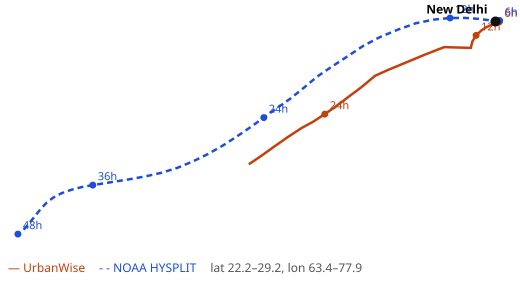

# Checking our trajectories against NOAA HYSPLIT

Smoke Trail and the Incoming Smoke Alert both depend on our simple trajectory model (see [METHODS.md](METHODS.md)). To see how far off it is, we compared it with [NOAA HYSPLIT](https://www.ready.noaa.gov/HYSPLIT.php), the trajectory model most air quality researchers use.

## Setup

- **Cities:** New Delhi, Ludhiana, Chandigarh
- **Trajectory:** backward, 48 hours, ending 10 Oct 2026 at 12:00 UTC (5:30 pm IST)
- **HYSPLIT:** READY web version, GFS 0.25° forecast from the 8 Oct 06z run, isobaric, starting 500 m above ground (about the 925 hPa level here). NOAA job numbers 135098 (Delhi), 135407 (Ludhiana), 135431 (Chandigarh).
- **UrbanWise:** the app's own `back_trajectory` code, 925 hPa winds from Open-Meteo, hourly steps, nearest point on a 2° grid

We ran it on 8 Oct, so both sides are working from forecast winds. The comparison tests our method; it can't say which one matches the real air on 10 Oct.

We measure the distance between the two paths at 6, 12, 24, 36 and 48 hours back. For scale, the app counts a fire as on the path if it's within 24 km of it at 6 h, 51 km at 24 h and 75 km at 48 h.

## Results

### 1. Same weather model as HYSPLIT (GFS)

This isolates our method: same winds, our simple maths.

| City | 6 h | 12 h | 24 h | 36 h | 48 h |
| :--- | ---: | ---: | ---: | ---: | ---: |
| New Delhi | 4 km | 89 km | 170 km | – | – |
| Ludhiana | 25 km | 338 km | 797 km | – | – |
| Chandigarh | 151 km | 264 km | 365 km | 355 km | 479 km |

"–" means our trace had left the wind grid (about 650 km out), so it stopped.



Delhi tracks HYSPLIT well for the first 6 hours and keeps the same direction. Ludhiana is fine for 6 hours and then heads the wrong way. Chandigarh is off from the start.

### 2. The app as it runs (Open-Meteo "best match" winds)

| City | 6 h | 12 h | 24 h | 36 h | 48 h |
| :--- | ---: | ---: | ---: | ---: | ---: |
| New Delhi | 138 km | 347 km | 935 km | 1503 km | 1738 km |
| Ludhiana | 35 km | 54 km | 101 km | 199 km | 410 km |
| Chandigarh | 126 km | 232 km | 329 km | 292 km | 427 km |

For Delhi the two weather models disagree badly: on 10 Oct GFS has air coming from the west, the app's winds (close to ECMWF) from the south-east. Neither our code nor HYSPLIT can fix that; it's forecast uncertainty.

### 3. Does the live smoke alert depend on the weather model?

On 8 Oct around 14:00 UTC we ran the app's Incoming Smoke Alert and Smoke Trail for Delhi on three weather models:

| Winds | Incoming Smoke Alert | Smoke Trail (past 48 h) |
| :--- | :--- | :--- |
| Best match (app) | Fires near Phalodi, in 30 h | 9 fires, Palwal, Charkhi Dadri, Faridabad… |
| GFS | Fires near Phalodi, in 21 h | 1 fire, Faridabad |
| ECMWF | Fires near Phalodi, in 32 h | 31 fires, Pakpattan, Fazilka, Bathinda… |

The alert held up: all three said smoke from the same fires, within 11 hours of each other. The Smoke Trail didn't: which fires it named depended almost entirely on the weather model.

## What we learned

1. **Our maths is OK in the short range, the grid is the weak point.** Taking the wind from the nearest point on a 2° grid (about 200 km) is too coarse, especially near the hills, where Chandigarh's nearest point is up in Himachal and the 925 hPa level is underground. In a quick test on the same GFS winds with a 1° grid, the 24 h error dropped from 170 to 98 km (Delhi), 797 to 6 km (Ludhiana) and 365 to 125 km (Chandigarh).
2. **The weather model matters more than our method.** Two good forecasts can send the air in opposite directions. A single trajectory should never be shown as certain.
3. **Treat the Smoke Trail's district names as a rough guide only**, not as "these fires caused your air".

## Reproduce it

1. Run a HYSPLIT back-trajectory on the [READY site](https://www.ready.noaa.gov/HYSPLIT_traj.php) with the settings above and save the "trajectory endpoints" text file as `docs/validation/hysplit_<city>.txt`. The three files we used are in that folder.
2. From `backend/`:

```bash
venv/bin/python scripts/validate_trajectory.py --name "New Delhi" \
  --lat 28.6139 --lon 77.209 --start 2026-10-10T12 \
  --hysplit ../docs/validation/hysplit_delhi.txt \
  --model gfs_seamless --svg ../docs/validation/delhi_gfs.svg
```

Leave out `--model` to use the app's default winds. Open-Meteo updates its forecasts every few hours, so re-running later gives slightly different numbers.
